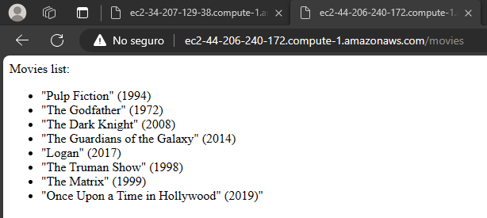
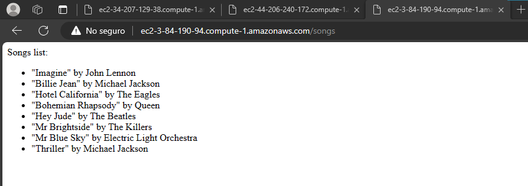

# webapp-automatically-deployed-to-aws
El objetivo de este ejercicio es desplegar una aplicación web en varias instancias de AWS EC2 usando AWS CloudFormation. Para la construcción de la aplicación se uso el framework de Python FastApi y para facilidad a la hora de desplegar el servicio en las diferentes instancias se usó Docker.

## Conceptos

### FastApi

[FastAPI](https://fastapi.tiangolo.com/es) es un web framework moderno y rápido (de alto rendimiento) para construir APIs con Python 3.8+ basado en las anotaciones de tipos estándar de Python.

### Docker
[Docker](https://www.docker.com/) es una tecnología de creación de contenedores que permite la creación y el uso de contenedores de Linux®. Con docker, puede usar los contenedores como máquinas virtuales extremadamente livianas y modulares.

### AWS
AWS o Amazon Web Services es un proveedor de servicios en la nube, ofrece servicios de almacenamiento, de recursos de computación, de aplicaciones, bases de datos, etc.

### EC2
Amazon Elastic Compute Cloud (EC2) es un servicio de cómputo en la nube de AWS que permite a los usuarios lanzar y administrar servidores virtuales escalables, conocidos como instancias, en la nube. Estas instancias pueden ejecutar una variedad de sistemas operativos y aplicaciones, y se utilizan para alojar aplicaciones, sitios web y otros recursos informáticos en la nube.

### CloudFormation
AWS CloudFormation es un servicio de administración de infraestructura como código que permite crear y gestionar recursos de AWS de manera automatizada y predecible mediante plantillas declarativas.


## Instalando los paquetes necesarios

**Instalando usando un archivo con una lista de paquetes**

```Bash
pip install -r requirements.txt
```

**Instalando directamente los paquetes**

```Bash
pip install fastapi
pip install "uvicorn[standard]"
```

[uvicorn](https://www.uvicorn.org) es una implementación de servidor web ASGI para Python.

## Ejecutando la aplicación

### Local

```Bash
uvicorn app.main:app --reload
```

### Docker

```Bash
docker build -t simple-web-app .
docker run -d --name web-app-container -p 80:8000 simple-web-app
```

### Pull and Run Image

```Bash
docker run -d -p 80:8000 --name simple-web-app-image-aws ricar8o/simple-webapp-fastapi
```

## Uso de la Plantilla en CloudFormation

En la plantilla [custom-template.json](custom-template.json) se definieron los parámetros, recursos y pasos para desplegar un security group, y 3 instancias donde cada una, a traves de docker, ejecute un contenedor de la imagen del aplicativo que fue subida a dockerhub.


1. Creando la pila con el archivo base

    

2. En la sección de especificar detalles de la plantilla se muestran los 5 parámetros que fueron definidos en la plantilla: la imagen que se va a desplegar, el puerto por el que se está ejecutando la aplicación dentro del contenedor, el tipo de instancia escogido para las 3 instancias que se crearán, la llave que se usará para acceder a las instancias y el rango de direcciones IP que tendrán permitida la conexión a las instancias por SSH.

    

3. Después de revisar los siguientes pasos y darle enviar en el último paso, se empezaran a construir los recursos

    

4. El stack se creó correctamente.

    

5. En la pestaña de recursos podemos ver las 3 instancias y el security group que se crearon.

    

6. En la pestaña de salidas podemos ver los outputs que se definieron en la plantilla, que son las urls de la aplicación ejecutada en las 3 instancias

    

7. Si accedemos a los links vemos que la aplicación se ejecutó exitosamente.

    
    
    

8. Y podemos acceder a sus rutas.

    
    
    